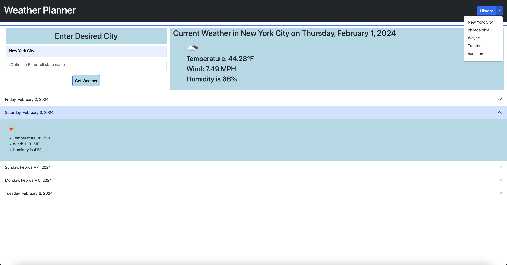

# <Plan Ahead>

## Description

A tool to grab the current, and future weather conditions for any selected city. Utilize the state name for better accuracy results

## Table of Contents

- [Installation](#installation)
- [Usage](#usage)
- [Credits](#credits)
- [License](#license)

## Installation

No installation required, page is already live

## Usage

Enter the desired city name, and press Get Weather. Optional state input field provides better accuracy results. History dropdown button in the top right corner keeps track of historical data of your searches
and will render the weather info for the specified city from the dropdown. Clicn on the items in the accirdion to display the future weather data

## Credits

Open Weather Map API for the usage of their API

## License

Standard MIT license

---
